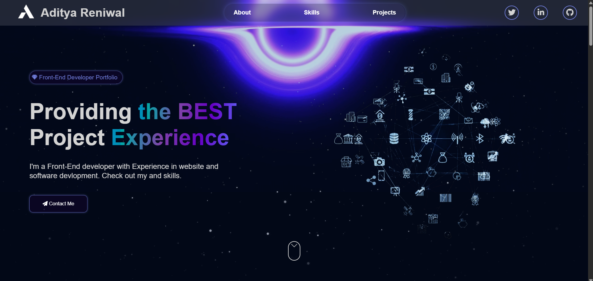

# 🚀 Aditya Reniwal – Developer Portfolio 💻🌌  

  
*📸 A glimpse into the homepage hero section – sleek, animated, and space-inspired.*

---

## 🌟 Live Preview  
⏳ _Coming soon... Stay tuned!_

---

## 🧠 Tech Stack Used  
Built using a clean, minimal, yet engaging stack:  

  
  
  
  
  

---

## ✨ Features  

- 🌀 **Stunning CSS animations** for the hero section and UI elements  
- 🎯 **Smooth navigation bar** with highlighted sections: About | Skills | Projects  
- 🧩 **Component-based layout** using HTML sections with semantic structure  
- 💬 **Call-to-action buttons** and contact link with subtle hover effects  
- 🌌 **Animated galaxy theme** with cosmic icons & glowing aesthetics  
- 🧲 **Interactive skills section** with **JS-powered slider animation** (🎥 see below)

---

## 🧪 Skills Section Preview  
🎥 _Video demo of the slider goes here_  

---

## 🛠 To-Do / Final Touches  
- [ ] Replace placeholder image icons with optimized assets  
- [ ] Final polish on animations and responsiveness  
- [ ] 🚀 **Deploy to GitHub Pages / Vercel / Netlify**  
- [ ] Add skill section slider video embed in this README  

---
## 🤝 Let's Connect

  
  
  

> 🔧 This portfolio is a work-in-progress. Image tweaks, final touches, and deployment will be wrapped up **ASAP**. Stay tuned!
